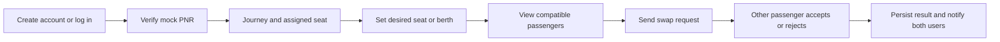
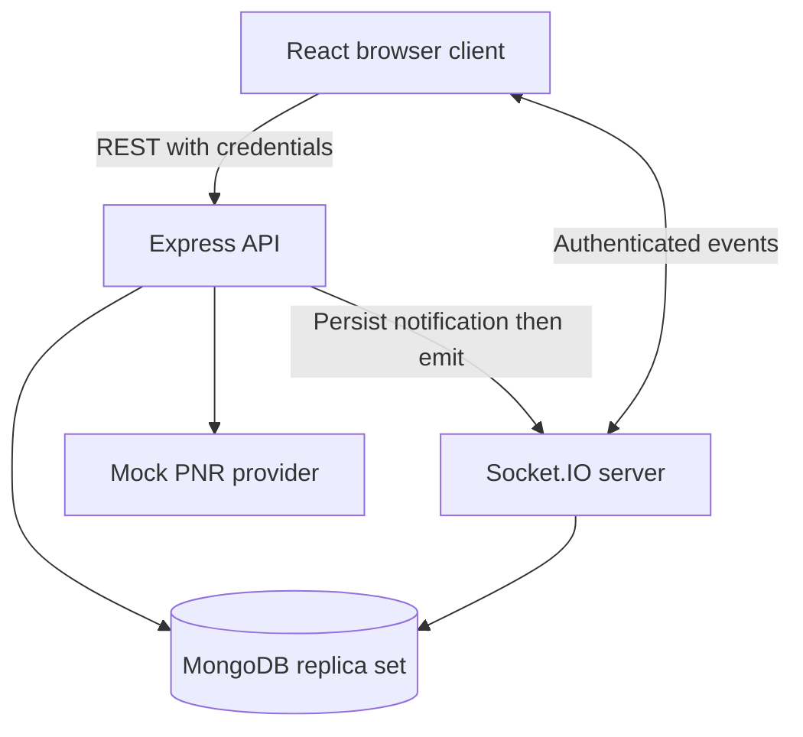
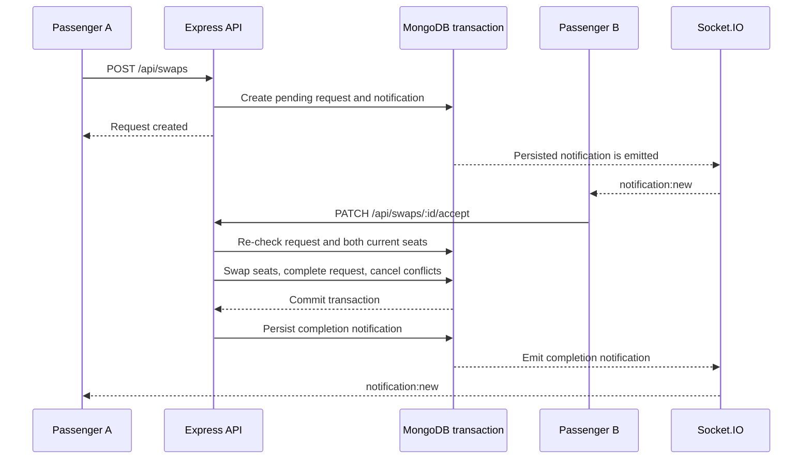

# SeatMate

SeatMate is a full-stack passenger seat-swapping platform for people travelling on the same
train or flight. A passenger verifies a journey with a PNR, describes the seat or berth they
would prefer, and discovers other verified passengers whose seats and preferences are mutually
compatible.

SeatMate is a portfolio/demo application. PNR verification uses a local mock dataset; it is not
connected to Indian Railways, IRCTC, an airline, or any live reservation provider. Accepting a
swap updates SeatMate's database only and does not change a real ticket.

## Contents

- [Product flow](#product-flow)
- [Features](#features)
- [Architecture](#architecture)
- [Repository structure](#repository-structure)
- [Local development](#local-development)
- [Environment variables](#environment-variables)
- [Application flows](#application-flows)
- [API reference](#api-reference)
- [Data model](#data-model)
- [Matching algorithm](#matching-algorithm)
- [Security and reliability](#security-and-reliability)
- [Testing](#testing)
- [Production deployment](#production-deployment)
- [Limitations and future work](#limitations-and-future-work)

## Product flow



The central rule is mutual consent. Matching suggests possible exchanges, but a seat changes only
after the receiving passenger explicitly accepts a pending request.

## Features

- Email/password registration and login.
- JWT sessions stored in HTTP-only cookies, never in `localStorage`.
- PNR verification against a clearly labelled in-memory mock provider.
- Train and flight journey support.
- Interactive seat maps for train berths and flight seat types.
- Seat preferences for berth/seat type, coach, and optional seat-number range.
- Compatibility matching with scores and human-readable reasons.
- Swap request lifecycle: pending, completed, rejected, cancelled, and expired.
- Atomic seat swapping with MongoDB transactions.
- Persisted notifications plus real-time Socket.IO updates.
- Responsive authenticated dashboard with journey, matches, requests, notifications, and profile views.
- Server-side validation, authorization, rate limiting, security headers, and structured errors.

## Architecture

SeatMate is a two-workspace monorepo:

```text
SeatMate/
├── client/       React + Vite frontend
├── server/       Express + TypeScript API and Socket.IO server
├── architecture.md
├── package.json
└── package-lock.json
```

### Runtime components



The frontend and backend are organized by feature rather than by a global technical layer. The
backend uses thin controllers, validated request boundaries, and service modules containing the
business rules. MongoDB is the source of truth for users, journeys, preferences, swap requests,
and notifications. Socket.IO is only a live delivery channel on top of persisted notifications.

For the deeper design rationale, indexes, transaction details, and scaling discussion, see
[architecture.md](architecture.md).

### Frontend

The frontend is a React 18 application built with Vite, TypeScript, Tailwind CSS, React Router,
Zustand, Axios, React Hook Form, Zod, and Socket.IO Client.

- `app/` owns route composition, authentication bootstrap, protected routes, and the application shell.
- `components/layout/` contains the responsive navigation and page shell.
- `components/ui/` contains reusable controls, states, and seat-map primitives.
- `features/` contains page and API code grouped by domain.
- `lib/` contains the configured Axios and Socket.IO clients.
- `store/` contains global authentication, notification, and toast state.
- `types/` contains frontend domain types aligned with API response shapes.

The public landing page loads immediately. Authenticated pages are lazy-loaded. API calls use
`withCredentials: true`, so the browser sends the HTTP-only session cookie automatically.

### Backend

The backend is an Express application running in a Node.js process:

- `config/` validates environment variables and connects to MongoDB.
- `features/` contains auth, journeys, PNR, preferences, swaps, users, and notifications.
- `middleware/` contains authentication, Zod validation, rate limiting, and error handling.
- `lib/` contains JWT, logging, async-handler, and application-error helpers.
- `sockets/` authenticates Socket.IO handshakes and assigns per-user rooms.
- `test/` contains integration helpers, factories, and in-memory replica-set setup.

## Repository structure

```text
client/src/
├── app/                 routes and protected-route handling
├── components/          layout and reusable UI primitives
├── design-system/       shared visual tokens
├── features/
│   ├── auth/            registration and login
│   ├── dashboard/       authenticated home screen
│   ├── journeys/        journey display and PNR verification UI
│   ├── landing/         public landing page
│   ├── notifications/   notification feed and socket hook
│   ├── pnr/             PNR API wrapper
│   ├── preferences/     preference form and seat map
│   ├── profile/         profile UI
│   └── swaps/           matches and swap requests
├── lib/                 Axios and Socket.IO clients
├── store/               Zustand stores
└── types/               frontend domain types

server/src/
├── config/              environment and database setup
├── features/
│   ├── auth/            auth routes, controller, service, validation
│   ├── journeys/        journey model and service
│   ├── notifications/   persisted notifications
│   ├── pnr/             mock provider and verification boundary
│   ├── preferences/     preferences and matching engine
│   ├── swaps/           swap request lifecycle
│   └── users/           user model and public DTO
├── lib/                 errors, JWT, logging, async helpers
├── middleware/          cross-cutting request middleware
├── sockets/             Socket.IO setup
├── test/                integration test infrastructure
├── types/               server domain and Express types
├── app.ts               Express middleware and route wiring
└── server.ts            process bootstrap and graceful shutdown
```

## Local development

### Prerequisites

- Node.js 20 or newer.
- npm.
- MongoDB running as a replica set. MongoDB Atlas provides this by default. A local single-node
  replica set is sufficient because accepting a swap uses a transaction.

### Install

From the repository root:

```bash
npm install
cp server/.env.example server/.env
cp client/.env.example client/.env
```

Set `MONGODB_URI` and a long local `JWT_SECRET` in `server/.env`. Never commit either `.env` file.
The `.env.example` files are safe templates intended for version control.

### Start MongoDB locally

Example macOS/Homebrew commands for a single-node replica set:

```bash
mkdir -p .mongo-data
mongod --dbpath .mongo-data --replSet rs0 --bind_ip 127.0.0.1 --port 27017
```

In another terminal, initialize the replica set with `mongosh`:

```javascript
rs.initiate({
  _id: 'rs0',
  members: [{ _id: 0, host: '127.0.0.1:27017' }],
});
```

Use this connection string for a local database:

```text
mongodb://127.0.0.1:27017/seatmate?replicaSet=rs0
```

### Start the application

Run both workspaces from the root:

```bash
npm run dev
```

Or run them independently:

```bash
npm run dev:server
npm run dev:client
```

The default development URLs are:

| Service      | URL                                |
| ------------ | ---------------------------------- |
| Frontend     | `http://localhost:5174`            |
| API          | `http://localhost:5000`            |
| Health check | `http://localhost:5000/api/health` |

If port `5000` is occupied, set `PORT=5001` in `server/.env` and update both client URLs to
`http://localhost:5001`.

### Useful commands

| Command                       | Purpose                                         |
| ----------------------------- | ----------------------------------------------- |
| `npm run dev`                 | Run client and server together                  |
| `npm run dev:client`          | Run only the Vite client                        |
| `npm run dev:server`          | Run only the API with `tsx watch`               |
| `npm run build`               | Build server and client                         |
| `npm run lint`                | Lint both workspaces with zero warnings allowed |
| `npm run test`                | Run the server Vitest suite                     |
| `npm run format`              | Format tracked project files with Prettier      |
| `npm run format:check`        | Check formatting without changing files         |
| `npm run typecheck -w client` | Type-check the frontend                         |
| `npm run typecheck -w server` | Type-check the backend                          |

## Environment variables

### Server

See [server/.env.example](server/.env.example) and
[server/.env.production.example](server/.env.production.example).

| Variable               | Description                                               |
| ---------------------- | --------------------------------------------------------- |
| `NODE_ENV`             | `development`, `test`, or `production`                    |
| `PORT`                 | API listening port                                        |
| `CLIENT_ORIGIN`        | Exact frontend origin used by CORS                        |
| `MONGODB_URI`          | MongoDB replica-set connection string                     |
| `JWT_SECRET`           | At least 16 characters; use a unique secret in production |
| `JWT_EXPIRES_IN`       | JWT and cookie lifetime, such as `7d`                     |
| `COOKIE_NAME`          | HTTP-only session cookie name                             |
| `RATE_LIMIT_WINDOW_MS` | General rate-limit window                                 |
| `RATE_LIMIT_MAX`       | General rate-limit request limit                          |

### Client

See [client/.env.example](client/.env.example) and
[client/.env.production.example](client/.env.production.example).

| Variable          | Description                              |
| ----------------- | ---------------------------------------- |
| `VITE_API_URL`    | API base URL including `/api`            |
| `VITE_SOCKET_URL` | API origin for Socket.IO, without `/api` |

Vite embeds client environment values at build time. Changing them after a production build has
no effect until the client is rebuilt.

## Application flows

### Authentication flow

1. The user submits registration or login credentials.
2. The server validates the body with Zod and hashes or compares the password with bcrypt.
3. The server signs a JWT containing the user id and email.
4. The JWT is set in an HTTP-only cookie. It is never returned for client-side storage.
5. On startup, the client calls `GET /api/auth/me` to restore the session.
6. `ProtectedRoute` waits for that result before showing authenticated content.

### PNR and journey flow

1. The user submits a PNR from the journey screen.
2. `PNRService` looks it up in `server/src/features/pnr/mockPnrData.ts`.
3. The server persists the journey and assigned-seat snapshot for the authenticated user.
4. A unique PNR constraint prevents another account from claiming the same PNR.
5. The resulting journey powers the seat map, preference form, and matching queries.

The provider is deliberately isolated behind a service boundary. Replacing the mock provider with
a real provider would not require changing controllers or frontend code, but real reservation
integration is outside this project.

### Matching flow

1. The user saves an active preference for a journey.
2. The server loads other active journeys with the same transport, vehicle, date, and class.
3. Only passengers with their own active preferences are considered swap candidates.
4. Hard filters remove incompatible berth types and, when requested, different coaches.
5. Remaining candidates receive a score and explanations.
6. The UI displays the ranked results; no seat is changed during matching.

### Swap acceptance flow



The acceptance transaction re-checks the request status and live seat values. This prevents two
concurrent accept operations from swapping seats twice or accepting a stale request. Requests
expire lazily when listed or acted on; there is no background job in this demo.

### Notification flow

Notifications are written to MongoDB before they are emitted through Socket.IO. The client loads
the persisted feed on connect and reconnect, then appends live `notification:new` events to the
Zustand notification store. A disconnected client therefore catches up from the database when it
reconnects.

## API reference

All endpoints are prefixed with `/api`. JSON errors use this shape:

```json
{
  "message": "Human-readable error",
  "errors": { "field": ["Optional validation details"] }
}
```

Except registration, login, and health, endpoints require the HTTP-only auth cookie.

### Health

| Method | Route         | Auth | Description                           |
| ------ | ------------- | ---- | ------------------------------------- |
| GET    | `/api/health` | No   | Returns `{ status: "ok", timestamp }` |

### Authentication

| Method | Route                | Body                        | Description                |
| ------ | -------------------- | --------------------------- | -------------------------- |
| POST   | `/api/auth/register` | `{ name, email, password }` | Create account and session |
| POST   | `/api/auth/login`    | `{ email, password }`       | Log in and set session     |
| POST   | `/api/auth/logout`   | None                        | Clear session cookie       |
| GET    | `/api/auth/me`       | None                        | Return current user        |

### PNR and journeys

| Method | Route                      | Body      | Description                             |
| ------ | -------------------------- | --------- | --------------------------------------- |
| POST   | `/api/pnr/verify`          | `{ pnr }` | Verify mock PNR and create journey      |
| GET    | `/api/journeys`            | None      | List the current user's active journeys |
| GET    | `/api/journeys/:journeyId` | None      | Read an owned journey                   |

### Preferences and matching

| Method | Route                                 | Body                                            | Description                         |
| ------ | ------------------------------------- | ----------------------------------------------- | ----------------------------------- |
| POST   | `/api/preferences`                    | Journey id, desired types, optional coach/range | Create or replace preference        |
| GET    | `/api/preferences/:journeyId`         | None                                            | Read preference for a journey       |
| PATCH  | `/api/preferences/:id`                | Preference fields and/or status                 | Update preference                   |
| GET    | `/api/preferences/:journeyId/matches` | None                                            | Return ranked compatible passengers |

### Swaps

| Method | Route                   | Body                                                  | Description                        |
| ------ | ----------------------- | ----------------------------------------------------- | ---------------------------------- |
| POST   | `/api/swaps`            | `{ requesterJourneyId, receiverJourneyId, message? }` | Send request                       |
| GET    | `/api/swaps/incoming`   | None                                                  | List received requests             |
| GET    | `/api/swaps/outgoing`   | None                                                  | List sent requests                 |
| PATCH  | `/api/swaps/:id/accept` | None                                                  | Receiver accepts; runs transaction |
| PATCH  | `/api/swaps/:id/reject` | None                                                  | Receiver rejects                   |
| PATCH  | `/api/swaps/:id/cancel` | None                                                  | Requester cancels                  |

### Notifications

| Method | Route                                     | Body | Description                                  |
| ------ | ----------------------------------------- | ---- | -------------------------------------------- |
| GET    | `/api/notifications`                      | None | Return recent notifications and unread count |
| PATCH  | `/api/notifications/:notificationId/read` | None | Mark one notification read                   |
| PATCH  | `/api/notifications/read-all`             | None | Mark all notifications read                  |

## Data model

All five Mongoose models use timestamps.

| Collection       | Purpose                                     | Important constraints                                      |
| ---------------- | ------------------------------------------- | ---------------------------------------------------------- |
| `User`           | Account identity and password hash          | Unique lowercased email; password hash excluded by default |
| `Journey`        | Verified PNR and current assigned seat      | Unique PNR; belongs to one user                            |
| `SwapPreference` | Desired seat types and matching constraints | One preference per journey                                 |
| `SwapRequest`    | One swap attempt and its lifecycle          | Partial unique index prevents duplicate pending pair       |
| `Notification`   | Durable user notifications                  | Indexed by user and creation time                          |

### Domain values

- Transport types: `train`, `flight`.
- Train seat types: `lower`, `middle`, `upper`, `side-lower`, `side-upper`.
- Flight seat types: `window`, `middle`, `aisle`.
- Journey statuses: `active`, `cancelled`.
- Preference statuses: `active`, `matched`, `cancelled`.
- Swap statuses: `pending`, `rejected`, `cancelled`, `expired`, `completed`.
- Notification types: received, completed, rejected, and cancelled swap events.

## Matching algorithm

The pure matching engine lives in `server/src/features/preferences/matching.ts`; database access
lives in `matching.service.ts`.

| Signal                               | Points | Behavior             |
| ------------------------------------ | -----: | -------------------- |
| Candidate has a desired type         |     40 | Required base signal |
| Candidate wants the caller's type    |     35 | Mutual-want bonus    |
| Same coach                           |     15 | Convenience bonus    |
| Candidate seat is in requested range |     10 | Optional range bonus |

Scores are capped at 100. Different coaches are removed when `sameCoach` is enabled. A match is
only a recommendation; it does not reserve a seat.

## Security and reliability

- Passwords use bcrypt and are never exposed in API responses.
- JWTs use HTTP-only cookies and are verified by both REST middleware and Socket.IO handshake middleware.
- CORS allows only the configured `CLIENT_ORIGIN` and credentials are enabled for cookies.
- Helmet supplies common HTTP security headers.
- Request bodies and route parameters are validated with Zod at the API boundary.
- General and sensitive-route rate limits protect authentication, PNR, and swap actions.
- Controllers are wrapped with async error handling and a centralized error middleware.
- User-owned resources are checked before they are returned or mutated.
- MongoDB transactions protect the multi-document swap acceptance path.
- A partial unique index protects against duplicate pending requests during races.

The current deployment is intentionally single-process. Redis is not required until the API is
scaled horizontally; at that point it would be needed for Socket.IO room delivery and shared rate
limits. More design details are in [architecture.md](architecture.md).

## Testing

Run the backend suite with:

```bash
npm test
# or
npm run test -w server
```

The server tests use Vitest and `mongodb-memory-server`'s in-memory replica set, so transaction
behavior is exercised without requiring a developer MongoDB instance.

| Test area          | Coverage                                                                      |
| ------------------ | ----------------------------------------------------------------------------- |
| Auth service       | Registration, hashing, duplicate email, login, JWT expiry and forgery         |
| PNR service        | Lookup, journey creation, idempotency, claimed and unknown PNRs               |
| Matching engine    | Hard filters, score signals, ranking, and explanations                        |
| Swap service       | Create, accept, reject, cancel, expiry, authorization, conflicts, concurrency |
| API integration    | Real HTTP requests, validation, authorization, duplicate and expired cases    |
| Socket integration | Real Socket.IO clients and user-scoped notification delivery                  |

The client currently relies on TypeScript, ESLint, and manual responsive/accessibility checks;
there is no automated frontend component or browser E2E suite yet.

## Production deployment

SeatMate deploys as two services. Vercel hosts the static React frontend; the Express and
Socket.IO backend must run on a persistent Node.js host such as Render, Railway, Fly.io, or a VM.
Vercel serverless functions are not a drop-in replacement for this backend because Socket.IO
requires a long-lived process and swap acceptance uses MongoDB transactions.

1. Provision MongoDB Atlas or another MongoDB replica set.
2. Deploy the `server/` workspace to a persistent Node.js host.
3. Configure the server variables from `server/.env.production.example`, including the Atlas
  `MONGODB_URI`, a new `JWT_SECRET`, and the Vercel frontend URL as `CLIENT_ORIGIN`.
4. Use `npm install` as the install command, `npm run build` as the build command, and
  `npm run start` as the start command when the host's root directory is `server/`.
5. Create a Vercel project from this repository with `client/` as the **Root Directory**.
6. Vercel will use `client/vercel.json`, run `npm run build`, and publish `dist/`.
7. Add these Vercel environment variables before deploying:
  `VITE_API_URL=https://your-api.example/api` and
  `VITE_SOCKET_URL=https://your-api.example`.
8. Use HTTPS for both applications so secure cookies and cross-origin Socket.IO work correctly.

### Vercel settings

When importing the repository into Vercel:

| Setting | Value |
| --- | --- |
| Root Directory | `client` |
| Framework preset | `Vite` |
| Build command | `npm run build` |
| Output directory | `dist` |
| Install command | `npm install` |

The `client/vercel.json` rewrite sends unknown paths to `index.html`, which is required for
React Router routes such as `/dashboard` and `/profile` to work after a page refresh.

### Backend settings

Configure these environment variables on the backend host, never in Git or Vercel:

```text
NODE_ENV=production
CLIENT_ORIGIN=https://your-project.vercel.app
MONGODB_URI=mongodb+srv://<user>:<password>@<cluster>/seatmate?retryWrites=true&w=majority
JWT_SECRET=<new-long-random-secret>
```

The backend host must expose its public URL over HTTPS. Add that exact URL to the Vercel client
variables as `VITE_API_URL` with `/api` appended and as `VITE_SOCKET_URL` without `/api`.

Production checklist:

- Use a fresh, high-entropy `JWT_SECRET`.
- Never commit `.env` files or database credentials.
- Confirm the database supports transactions.
- Confirm API CORS origin exactly matches the frontend URL.
- Confirm the frontend API and Socket.IO URLs were embedded before the build.
- Add a reverse proxy or platform health check for `/api/health`.

There is currently no Dockerfile or CI/CD workflow in this repository.

## Limitations and future work

Current limitations:

- PNR data is mock data only.
- A completed swap changes only SeatMate's local record.
- The server is single-process and has no Redis adapter.
- There is no password reset or email verification.
- There are no automated frontend or browser E2E tests.
- The product is English-only.
- There is no admin moderation interface.

Possible next steps:

- Add a real PNR provider adapter where legally and operationally appropriate.
- Add frontend component and Playwright E2E coverage.
- Add password reset, email verification, and web push notifications.
- Add multi-passenger PNR modeling.
- Add Redis-backed Socket.IO and rate-limit stores when horizontally scaling.
- Add CI checks, Docker support, observability, and deployment manifests.

## License

This is a personal/portfolio project. No license has been selected yet.
